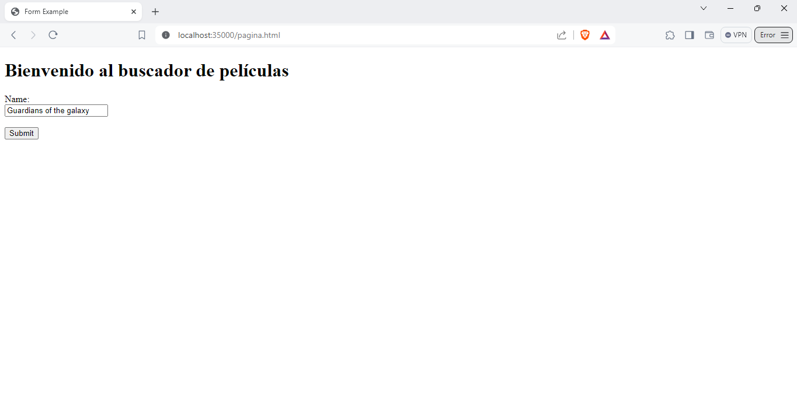
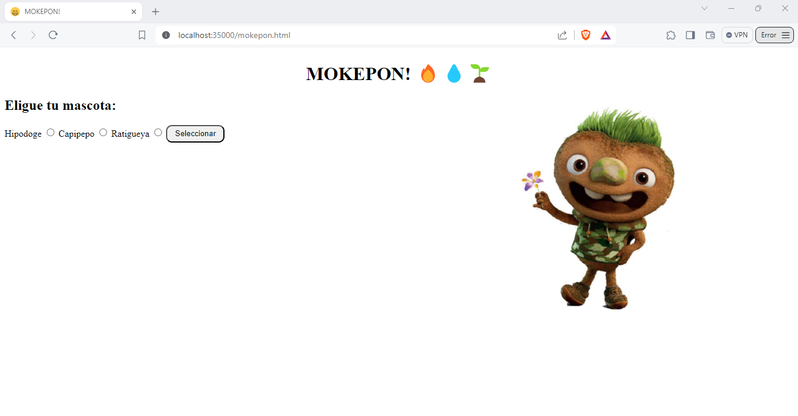
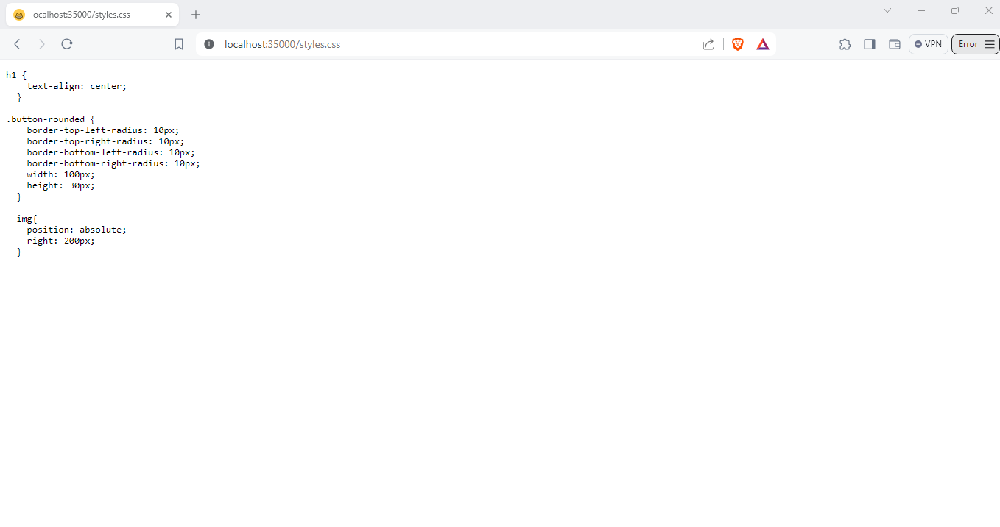
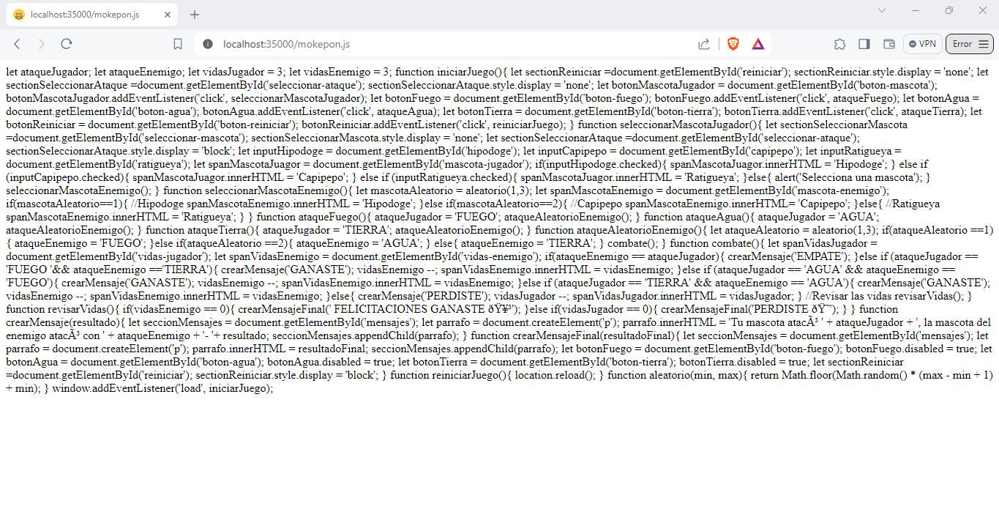
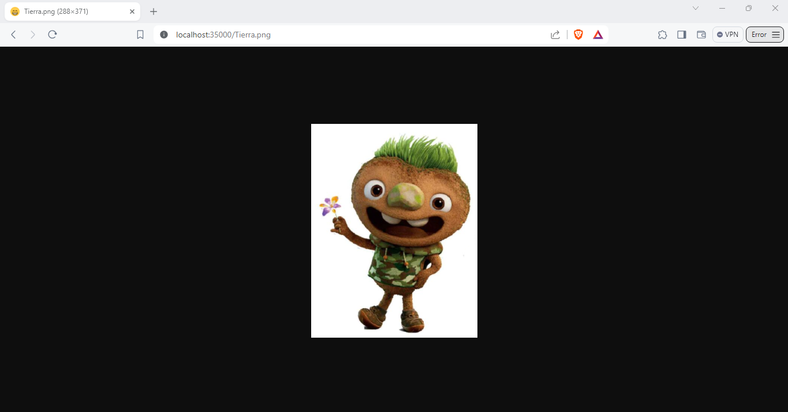
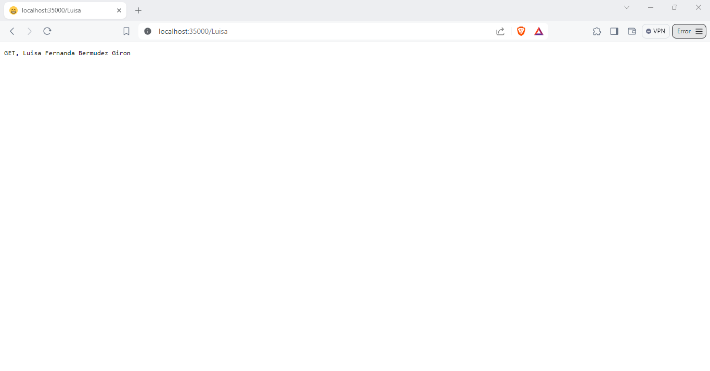
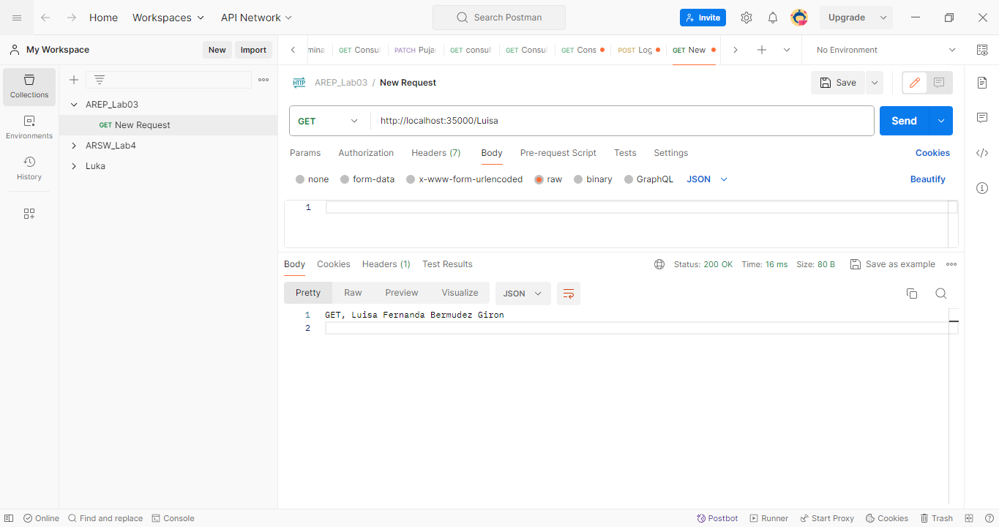
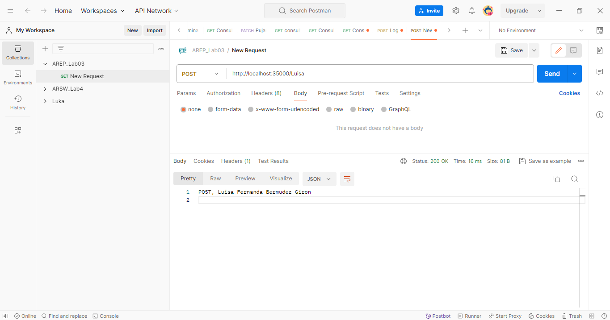

# Taller 04: Modularización con virtualización e introducción a Docker
Para este taller se creó un servidor Web (tipo Apache) en Java capaz de devolver páginas html e imágenes tipo PNG. Este:
* Provee un framework IoC para la construcción de aplicaciones web a partir de POJOS.
* Atiende múltiples solicitudes no concurrentes. 

## Prerequisitos
Los prerrequisitos tecnológicos que necesita este taller son:

* [Maven](https://maven.apache.org/): Maven es un herramienta que proporciona una estructura estándar, gestión de dependencias y automatización de tareas en los proyectos software desarrollados en Java.

* [GitHub](https://platzi.com/blog/que-es-github-como-funciona/): Es una plataforma de desarrollo colaborativo basado en Git que utiliza un sistema de versiones distribuida para el seguimiento del código fuente durante el desarrollo.

* [Postman](https://www.postman.com/): Es una herramienta de colaboración para el desarrollo de APIs. Se utiliza principalmente para realizar pruebas de API, depurar y desarrollar API de forma más eficiente.

## Instalación
1. Clone el repositorio:
```
git clone https://github.com/AREP-2024/Taller4.git
```
2. Aceda a la carpeta principal del repositorio que acaba de clonar:
```
cd Taller4
```

3. Se hace la construcción del proyecto: 
```
 mvn package
```

## Corriendo
Ahora de debe poner a ejecutar el servidor:

### Windows
```
 mvn exec:java -"Dexec.mainClass"="edu.escuelaing.arep.ASE.app.HttpServer"
```

### Linux
```
mvn exec:java -Dexec.mainClass="edu.escuelaing.arep.ASE.app.HttpServer"
```
En su browser de preferencia coloque las siguientes URL para poder ver la aplicación web en ejecución: 

* La API de películas: 
```
http://localhost:35000/pagina.html
```


* Pagina web creada con html, css, JavaScript y una imagen (página web personalizada): 
```
http://localhost:35000/mokepon.html
```


* El archivo css:
```
http://localhost:35000/styles.css
```


* El archivo JavaScript:
```
http://localhost:35000/mokepon.js
```


* La imagen .png:
```
http://localhost:35000/Tierra.png
```


* Para la petición GET creada en el controlador base, usted podrá evidenciar su funcionamiento tanto en browser como en Postman :
    * En el browser use la siguiente URL:
    ```
    http://localhost:35000/Luisa
    ```
    

    * En Postman haga uso del método GET junto con la siguiente URL:
    ```
    http://localhost:35000/Luisa
    ```
    

* Para la función POST creada en el controlador base, usted podrá evidenciar su funcionamiento con Postman:
```
http://localhost:35000/Luisa
```


## Corriendo Test
Se ejecuta el siguiente comando:
```
mvn test
```

## Arquitectura del programa
Dentro de esta arquitectura podrá encontrar los siguientes paquetes:
* src\main\java\edu\escuelaing\arep\ASE\app\app: Este paquete esta compuesto por otros paques y dos clases:
    * La clase **HttpConnection** encapsula la lógica para realizar solicitudes HTTP y gestionar el almacenamiento en caché de la información de las películas obtenidas de una API externa.
    * La clase **HttpServer** implementa un servidor HTTP básico que maneja solicitudes y respuestas HTTP, sirviendo recursos estáticos y ejecutando controladores para endpoints registrados.

* src\main\java\edu\escuelaing\arep\ASE\app\annotation: Se encuentran dos clases que son la construcción (abstracción) de las anotaciones principales del servidor
    * La clase **Controller** se usa para marcar una clase como controlador.
    * La clase **RequestMapping** se usa para especificar la ruta de la URL y el método HTTP.

* src\main\java\edu\escuelaing\arep\ASE\app\config: Se encuentra una clase de configuración. 
    * La clase **Scanner** se usa para escanear y registrar, controladores y métodos anotados dentro de la aplicación.

* src\main\java\edu\escuelaing\arep\ASE\app\controller: Se encuentra compuesto por dos clases que son los controladores del aplicativo.
    * La clase **ControladorBase** como su nombre lo indica es un controlador base que funciona como ejemplo sobre el comportamiento de la aplicación web. 
    * La clase **MySparkController** es el controlador principal de la aplicación web este registra, ejecuta y verifica los endpoints.

* src\main\java\edu\escuelaing\arep\ASE\app\exception: Este paquete esta compuesto por una clase y se utiliza para manejar los errores y las excepciones de la aplicación. 
    * La clase **HttpException** maneja los errores y las excepciones del HttpServer.

* src\main\java\edu\escuelaing\arep\ASE\app\http: Este paquete esta compuesto por cinco clases que sirven como apoyo para el servidor http.
    * La clase **HttpFunction** es un manejador para los endpoint del servidor Http.
    * La clase **Metodo** es una clase tipo enum donde se especifican las constantes GET y POST.
    * La clase **Registry** es el registro que maneja y almacena los endPoints con sus correspondientes handlers, permitiendo el enrutamiento de solicitudes Http en el servidor web.
    * La clase **Request** va a servir para abstraer el contenido de una peticin http.
    * La clase **Response** va a´servir para abstraer el contenido de una respuesta http.

* src\main\java\edu\escuelaing\arep\ASE\app\resources\public: En este paquete usted podra encontrar todos los archivos estaticos como lo son:
    * mokepon.html
    * mokepon.js
    * pagina.html
    * styles.css
    * Tierra.png

## Construido con

* [Maven](https://maven.apache.org/): Maven es un herramienta que proporciona una estructura estándar, gestión de dependencias y automatización de tareas en los proyectos software desarrollados en Java.

* [GitHub](https://platzi.com/blog/que-es-github-como-funciona/): Es una plataforma de desarrollo colaborativo basado en Git que utiliza un sistema de versiones distribuida para el seguimiento del código fuente durante el desarrollo. 

* [Visual Studio Code](https://code.visualstudio.com/):Es un entorno de desarrollo integrado (IDE) ligero y de código abierto desarrollado por Microsoft

* [Java 17](https://www.java.com/es/download/help/whatis_java.html): Es un lenguaje de programación de propósito general, orientado a objetos y diseñado para ser independiente de la plataforma. 

* [HTML](https://developer.mozilla.org/es/docs/Web/HTML): Es el lenguaje de marcado que se utiliza para crear páginas web. Se define como un conjunto de etiquetas que se utilizan para estructurar y dar significado al contenido de una página web.

* [JavaScript](https://aws.amazon.com/es/what-is/javascript/): Es un lenguaje de programación de alto nivel, interpretado y orientado a objetos. Se utiliza principalmente en el desarrollo web para crear páginas web interactivas y dinámicas

* [CSS](https://lenguajecss.com/css/introduccion/que-es-css/) : Es un lenguaje de diseño utilizado para definir como se deben mostrar los elementos de una página web.

## Autor
[Luisa Fernanda Bermudez Giron](https://www.linkedin.com/in/luisa-fernanda-bermudez-giron-b84001262/) - [Luisa Fernanda Bermudez Giron](https://github.com/LuisaGiron)

## Licencia 
**©** Luisa Fernanda Bermudez Giron, Estudiante de Ingeniería de Sistemas de la Escuela Colombiana de Ingeniería Julio Garavito.
